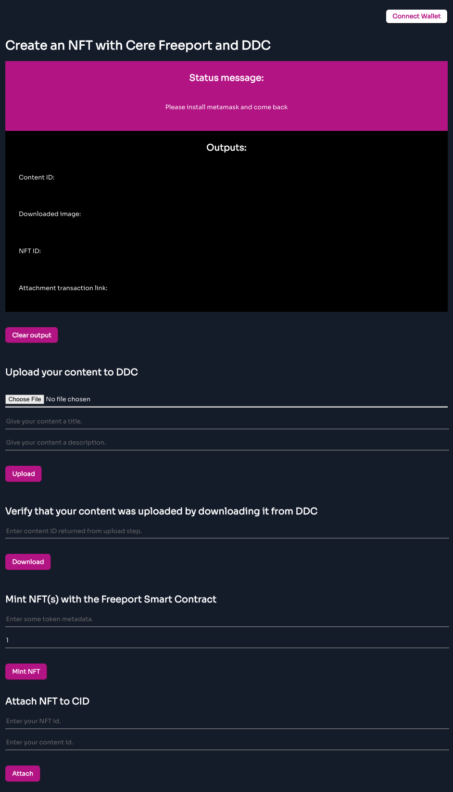

# Minting NFTs on Polygon with Cere Freeport
In this tutorial, you'll learn how to connect a React frontend to Cere Freeport's smart contracts using Metamask and the Freeport SDK. You will learn how to:

* Mint NFTs using Cere Freeport.
* Upload their corresponding asset (e.g., image) to Cere's DDC.
* ~~Locate and download this asset from Cere's DDC.~~ (In progress) 

Here's what your final product will look like. 



# The process of minting an NFT
The process of minting NFTs generally involves 3 steps:

1. An ERC-1155 smart contract must be published on the blockchain.
2. A minting function within the smart contract is called and creates a unique instance of your NFT on the blockchain. Minting functions generally require two inputs: a `recipient` (the wallet to receive this NFT) and a `tokenURI` (a string that points to a JSON containing the metadata of the NFT).
3. The asset that the NFT respresents must be uploaded and stored somewhere. Preferably in a decentralized fashion. 

Cere Freeport abstracts away Step 1 while removing much of the overhead associated with steps 2 and 3. This allows developers to mint their NFTs in a few lines of code and easily integrate the minting and asset upload process into their own applications.


# Getting set up

## Getting Testnet MATIC in your wallet

### Add Mumbai to your Metamask wallet
Mumbai is not enabled by default in Metamask. You will have to add it as one of the connected networks manually if it isn't already. Here's a [guide](https://blog.pods.finance/guide-connecting-mumbai-testnet-to-your-metamask-87978071aca8) to do that.

### Getting testnet matic in your wallet
You'll need some testnet matic tokens going forward.
* Navigate to [https://faucet.polygon.technology/](https://faucet.polygon.technology/)
* Click on the Mumbai Testnet tab.
* Enter your wallet address and click submit.

You should receive some testnet matic tokens after a minute.

## Installing dependencies and starting your project

First, go to the Freeport NFT-minter GitHub repository and clone this repository to your local environment. This repository contains two folders:
* `starter-files`: contains the starter files which include the React UI and the code to connect to Metamask. These are the files we'll be editing in this tutorial. 
* `freeport-nft-minter`: contains the completed tutorial.

Before starting, we must install the Cere Freeport SDK along with some other dependencies in our project. In a terminal, navigate to the `starter-files` folder and run the following command:
    
    npm install -S ethers axios @cerefreeport-sdk

Once these have finished installing, run the following command in the `starter-files` directory
    
    npm start

If a browser does not open automatically, open one and navigate to [http://localhost:3000/](http://localhost:3000/). Here you'll see the frontend of your project. These are the functionalities that you will be implementing.

 # The files you'll be working on

Open the following two files:


1. `src/actions.js`: this file contains the functions we need for interacting with our Metamask wallet, the Freeport smart contract and the DDC.
2. `src/Main.js`: this file contains the user inferface and the functions required to tie the two files together.

Now let's start coding! Each code block below is preceeded by a header representing the function you're editing and its corresponding file name in [brackets]. 
<!-- Let's break these down.  

## `1. actions.js`
### a. Imports
```javascript
import { importProvider, getFreeportAddress, createFreeport } from "@cere/freeport-sdk";
import { get as httpGet, post as httpPost } from "axios";
```
### b. Some helper functions
```javascript
const sleepX = async (x) => new Promise((resolve, _) => {
  setTimeout(() => resolve(), x*1000); 
});

export const utilStr2ByteArr = (str) => {
    const arr = [];
    for (let i = 0; i < str.length; i++) {
        arr.push(str.charCodeAt(i));
    }
    return arr;
}
```
### c. The functions you'll be completing
```javascript
export const connectWallet = async () => {
  // TO DO
};

export const getCurrentWalletConnected = async () => {
  // TO DO
};

export const mintNFT = async (quantity, metadata) => {
  // TO DO
};

export const upload2DDC = async (data, title, description) => {
  // TO DO
};

export const downloadFromDDC = async (contentId) => {
  // TO DO
};
```


## `2. Main.js`

### a. Imports
```javascript
import { React, useEffect, useState } from "react";
import { connectWallet, getCurrentWalletConnected, mintNFT, upload2DDC, downloadFromDDC } from "./actions.js";
```
### b. State variables
`useState` declares "state variables". Normally variables disappear when functions exit, but state variables are preserved. 
```javascript
const [walletAddress, setWalletAddress] = useState("");
const [metadata, setMetadata] = useState("");
const [cid, setCid] = useState(null);
const [qty, setQty] = useState(null);
const [uploadData, setUploadData] = useState("");
const [uploadDataTitle, setUploadDataTitle] = useState("")
const [uploadDataDescription, setUploadDataDescription] = useState("")
// For ddc download
const [content, setContent] = useState(null);
```
### c. Another state variable: `status`
We'll update this variable with messages according to the outputs of the functions we call. This gives the user some feedback.  
```javascript
const [status, setStatus] = useState("");
```
### d. The functions you'll be completing
```javascript
function addWalletListener() {
  // TO DO 
};

useEffect(async () => {
  // TO DO 
}, []);

const connectWalletPressed = async () => {
  // TO DO 
};

// Functions to fill out
const onMintPressed = async () => {
  // TO DO 
};

const onUploadPressed = async () => {
  // TO DO 
}

const onDownloadPressed = async () => {
  // TO DO 
}
```

### e. The user interface
Notice that the buttons and placeholders call our functions and update the state variables as the user interacts with them. 
```javascript
return (   
  <div className="Minter">
    <button id="walletButton" onClick={connectWalletPressed}>
      {walletAddress.length > 0 ? (
        "Connected: " + String(walletAddress).substring(0, 6) + "..." + String(walletAddress).substring(38)
      ) : (
        <span>Connect Wallet</span>
      )}
    </button>
    <br></br>
    <h1 id="title"> Create an NFT with Cere Freeport and DDC </h1>
    <p id="status"> {status} </p>

    <br></br>
    <h2> Upload content to DDC: </h2>
    <input type="text" placeholder="Enter content to upload to DDC. (e.g., a random string)" onChange={(event) => setUploadData(event.target.value)}/>
    &nbsp;
    <input type="text" placeholder="Give your content a title." onChange={(event) => setUploadDataTitle(event.target.value)}/>
    &nbsp;
    <input type="text" placeholder="Give your content a description." onChange={(event) => setUploadDataDescription(event.target.value)}/>
    <button id="mintButton" onClick={onUploadPressed}> Upload </button>      

    <br></br><br></br>
    &nbsp;
    <h2> Now download that content from DDC: </h2>
    <input type="text" placeholder="Enter content ID returned from upload step." onChange={(event) => setCid(event.target.value)}/>
    <button id="mintButton" onClick={onDownloadPressed}> Download </button>      


    <br></br><br></br>
    &nbsp;
    <h2> Mint an NFT with Freeport: </h2>
    <input type="text" placeholder="Enter some token metadata." onChange={(event) => setMetadata(event.target.value)}/>
    &nbsp;
    <input type="number" placeholder="Enter the number of copies to mint." value={qty} onChange={(event) => setQty(event.target.value)}/>
    <button id="mintButton" onClick={onMintPressed}> Mint NFT</button>      
  </div>
);
```
 -->


# Connecting to your Metamask wallet

## `1. connectWallet [actions.js]`


```javascript
export const connectWallet = async () => {
  // Check if window.ethereum is enabled in your browser (i.e., metamask is installed)
  if (window.ethereum) {
    try {
      // Prompts a metamask popup in browser, where the user is asked to connect a wallet.
      const addressArray = await window.ethereum.request({method: "eth_requestAccounts"});
      // Return an object containing a "status" message and the user's wallet address.
      return { status: "Follow the steps below.", address: addressArray[0] };
    } catch (err) {
        return { address: "", status: err.message };
    }
    // Metamask injects a global API into websites visited by its users at 'window.ethereum'.
    // If window.ethereum is not enabled, then metamask must not be installed. 
  } else { 
      return {address: "", status: "Please install the metamask wallet"};
  }
};
```

## `2. getCurrentWalletConnected [actions.js]`
```javascript
export const getCurrentWalletConnected = async () => {
  if (window.ethereum) {
    try {
      // Get the array of wallet addresses connected to metamask
      const addressArray = await window.ethereum.request({ method: "eth_accounts" });
      // If it contains at least one wallet address
      if (addressArray.length > 0) {
        return { address: addressArray[0], status: "Follow the steps below." };
      // If this list is empty, then metamask must not be connected.
      } else {
        return { address: "", status: "Please connect to metamask." };
      }
      // Catch any errors here and return them to the user through the 'status' state variable.
    } catch (err) {
      return { address: "", status: err.message };
    }
    // Again, if window.ethereum is not enabled, then metamask must not be installed.
  } else {
      return { address: "", status: "Please install the metamask wallet" };
  }
};
```

## `3. addWalletListner [actions.js]`
Update the UI when wallet state changes, e.g. when user adds an account, switching between accounts, or disconnects their account. 
```javascript
function addWalletListener() {
  // Again, check if metamask is installed and if it is,
  if (window.ethereum) { 
      // Here, we listen for state changes in the metamask wallet such as
      window.ethereum.on("accountsChanged", (accounts) => {
        // If there is at least one account, update the state variables 'walletAddress' and 'status'
        if (accounts.length > 0) {
          setWalletAddress(accounts[0]);
          setStatus("Follow the steps below.");
        // If metamask is installed but there are no accounts, then it must not be connected.
        } else {
          setStatus("Connect to Metamask using the top right button.");
        }
      });
    // If metamask is not installed, then ask them to install it. 
  } else {
      setStatus("Please install metamask and come back");
  }
};
```


## ` 4. connectWalletPressed [Main.js]`
```javascript
const connectWalletPressed = async () => {
  // Call our connectWallet function from the previous step and await response.
  const walletResponse = await connectWallet();
  // Recall that 'connectWallet' returns an object with two elements: address and status.
  // Update the 'status' and 'walletAddress' state variables with this new information. 
  setStatus(walletResponse.status);
  setWalletAddress(walletResponse.address);
};
```


## ` 5. useEffect [Main.js]` 
`useEffect()` is a React hook that is called after the component is rendered. It accepts 2 arguments: `callback` the function containing the side-effect logic that executes right after changes are pushed to DOM, and `dependencies`, which control when you want this logic to run. The `useEffect()` executes `callback` only if `dependencies` have changed between renderings. We leave the `dependencies` array empty to execute this logic on the first render only. Because it's empty, the condition to re-execute the `callback` logic will never be met again. 

```javascript
useEffect(async () => {
  // The 'callback' side-effect logic
  const {address, status} = await getCurrentWalletConnected();
  setWalletAddress(address)
  setStatus(status); 
  addWalletListener();
  // The 'dependencies' array
}, []);
```


# Uploading your asset to DDC

## `1. upload2DDC [actions.js]`
This is where we start using Cere Freeport. 
```javascript
export const upload2DDC = async (data, title, description) => {
    // Get the wallets that are connected to metamask
    const accounts = await window.ethereum.request({ method: "eth_accounts" });
    // Get the user's wallet address
    const minter = accounts[0]
    // Here we request that the user shares their public encryption key.
    const minterEncryptionKey = await window.ethereum.request({method: 'eth_getEncryptionPublicKey', params: [minter]});
    // Create a new provider, which is an abstraction of a connection to the Ethereum network
    const provider = importProvider()
    // Get the user's account. A 'signer' is an abstraction of an Ethereum account.
    const signer = provider.getSigner();
    // Wait one second.
    await sleepX(1);
    // Create the signature 
    const signature = await signer.signMessage(`Confirm asset upload\nTitle: ${title}\nDescription: ${description}\nAddress: ${minter}`); 


    // Construct a set of key/value pairs representing the fields required by the Cere DDC API. 
    let fdata = new FormData();
    fdata.append('minter', minter); 
    fdata.append('file', new File( utilStr2ByteArr(data), "my-ddc-file.txt", {type: "text/plain"})); 
    fdata.append('signature', signature); 
    fdata.append('minterEncryptionKey', minterEncryptionKey); 
    fdata.append('description', description); 
    fdata.append('title', title); 

    // Make an HTTP post request to the Cere DDC API using the FormData object we defined above.
    const httpPostResponse = await httpPost("https://ddc.freeport.dev.cere.network/assets/v1", fdata, { headers: {'Content-Type': 'multipart/form-data'} });
    // This post request contains a string corresponding to the uploadId of your upload request
    const uploadId = httpPostResponse.data.id

    // With this uploadId, we make a get request to the Cere DDC API to get the contentId of our upload. 
    // This content will not exist until the upload is complete.
    // We repeat this request until the file is uploaded or the upload fails (max 3 attempts)
    let contentId = null;
    var counter = 0;
    while (!contentId) {
      counter ++;
      let httpGetResponse = await httpGet(`https://ddc.freeport.dev.cere.network/assets/v1/${uploadId}`);
      contentId = httpGetResponse.data.result;
      // If the contentId is no longer null, 
      if (contentId){
        // Exit the function call and return the contentId and an informative 'status'.
        return {contentId: contentId, status: `Uploaded. The content ID of your DDC upload is: ${contentId}`};
      }
      if (httpGetResponse.failed) {
        return { contentId: "", status: "DDC upload failed" };
      }
      if (counter == 2){
        return { contentId: "", status: "Unable to get upload status after 3 attempts" };
      }
      // Wait 10 seconds before trying again.
      await sleepX(10);
    }
};
```

## `2. onUploadPressed [Main.js]`
This function simply calls the upload2DDC function and sets the state variable `status` with the status returned.
```javascript
const onUploadPressed = async () => {
  const { contentId, status } = await upload2DDC(uploadData, uploadDataTitle, uploadDataDescription);
  setStatus(status);
}
```


# Downloading your asset from DDC

To do. The download functionality is still not fully implemented.  

## `1. downloadFromDDC [actions.js]` 
```javascript
export const downloadFromDDC = async (contentId) => {
  const provider = importProvider();
  const accounts = await window.ethereum.request({ method: "eth_accounts" });
  const minter = accounts[0];
  
  const signer = provider.getSigner();
  await sleepX(1);
  const signature = await signer.signMessage(`Confirm identity:\nMinter: ${minter}\nCID: ${contentId}\nAddress: ${minter}`); 
  const results = await httpGet(`https://ddc.freeport.dev.cere.network/assets/v1/${minter}/${contentId}/content`, { headers: { 'X-DDC-Signature': signature }});
  console.log(results);
  return results.data;
};

const sleepX = async (x) => new Promise((resolve, _) => {
  setTimeout(() => resolve(), x*1000); 
});
```

## `2. onDownloadPressed [Main.js]` 
```javascript
const onDownloadPressed = async () => {
  const content = await downloadFromDDC(cid);
  setContent(content);
  setStatus(`Downloaded. Here's your content: ${content}`);
}
```

# Minting your NFT 


## `1. mintNFT [actions.js]`
The `mintNFT` function takes two input parameters: `quantity`, the number of NFT's you would like to mint, and `metadata`, a string that will be permanently attached to your NFT.
```javascript
export const mintNFT = async (quantity, metadata) => {
  // Do not allow the user to mint an NFT without metadata. Must not be empty string. 
  if (metadata.trim() == "" || (quantity < 1)) {
    return { success: false, status: "Make sure all fields are completed before minting." }
  }

  // Create a new provider, which is an abstraction of a connection to the Ethereum network.
  const provider = importProvider();
  // Select 'dev', 'stage', or 'prod' environment to determine which smart contract to use. Default is 'prod'.
  const env = "prod";
  // Get the appropriate Freeport contract address
  const contractAddress = await getFreeportAddress(provider, env); 
  // Create a Freeport object using the provider and Freeport contract address
  const cereFreeport = createFreeport( { provider, contractAddress} );
  try {
    // Call the issue() function in the Freeport smart contract.
    const tx = await cereFreeport.issue(quantity, utilStr2ByteArr(strMetadata));
    // Return a meaningful status that will help verify that our transaction went through.
    return { success: true, status: "Check out your transaction on Polygonscan: https://mumbai.polygonscan.com/tx/" + tx.hash}
    // If something goes wrong, catch that error. 
  } catch (error) {
    return { success: false, status: "Something went wrong: " + error.message }
  }
};
```
## `2. onMintPressed [Main.js]`
This function simply calls the mintNFT function and sets the state variable `status` with the status it returns.
```javascript
const onMintPressed = async () => {
  const { status } = await mintNFT(+qty, metadata)
  setStatus(status);
};
```